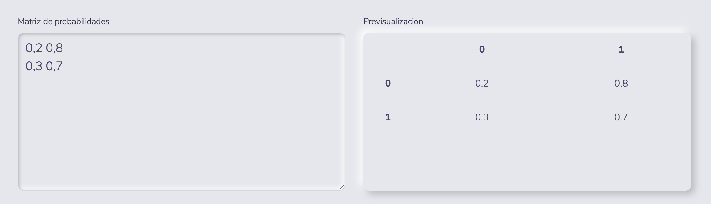
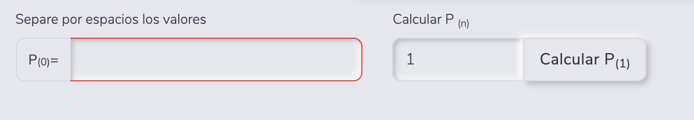
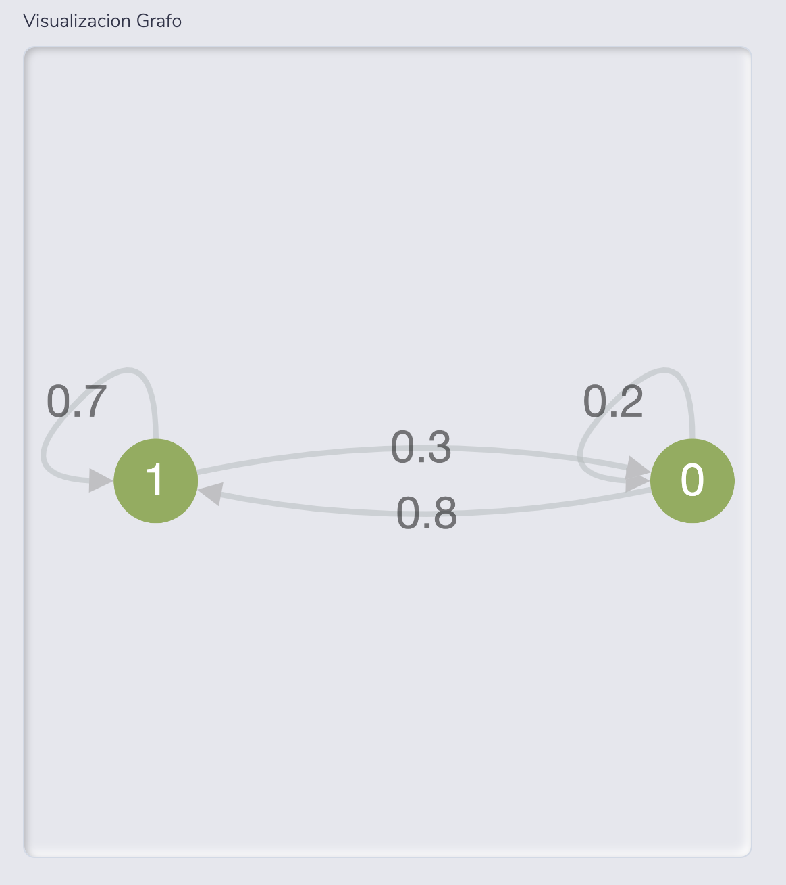

# Calculadora basica para cadenas de Markov

### Uso

#### Creacion de Matriz

En la parte izquiera los valores por fila se ingresan separandolos espacios en blanco, para crear una nueva fila es con un salto de linea

Ejemplo

>
> 0,2 0,8
>
> 0,3 0,7
>

En la parte derecha solo se mostrara una previsualizacion de la tabla actual

#### Creacion de Probabilidad inicial

Para la probabilidad inicial separe por espacios los valores

Ejemplo

> 1 0 0

#### Visualizacion de estados

Aqui solo se mostrara la representacion grafica de la matriz

